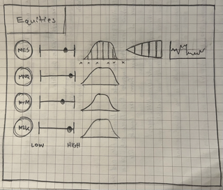

# tradingbuddy - [Harvard CS50P](https://www.edx.org/course/cs50s-introduction-to-programming-with-python) final project

#### Video Demo: https://youtu.be/Ogssa1nArto

## about this project...

i've been involved in financial markets for nearly ten years. with that experience i've learned
that simple statistics can be a useful aid when deciding which markets to trade. tradingbuddy is a 
python application that when given a dictionary of futures contract symbols generates a .pdf report
with statistics and visuals to get a mathematical feel for a markets' movement.

summary statistics include:
* current price relative to 3-month high and low
* daily move standard deviations
* 3-month percent return

here's a simple schema of what the .pdf looks like!



trading buddy currently supports
* data download from databento
* statistical calculations via pandas
* plot generation with matplotlib
* pdf writing using fpdf2

#### stack...

tradingbuddy uses end of day closing prices over a three month period. the data is fetched
via the databento API.

the data comes in very cleanly from databento and i use pandas and numpy to run calculations. the .csv data is stored on disk along with a percentage return graphic generated with matplotlib. the results for each symbol's statistics are stored in in-memory ordered dictionary.

finally, the results for each symbol are written to a .pdf using a custom pdf class from the fpdf2 library. modifying the default class allowed me to easily embed shapes with custom text, headers, and footers.

***

#### notes:
* [databento docs](https://docs.databento.com/)
* [databento python wrapper](https://bit.ly/3Iu88pi)
* [databento smart symbology](https://bit.ly/3ilxrza)
* [fpdf2 docs](https://pyfpdf.github.io/fpdf2/index.html)

***
### reference:

#### virtual environments
Create a Python3 Virtual Environment: 
```python3 -m venv env```

Activate the Virtual Environment:
```source env/bin/activate```

Deactivate the Virtual Environment:
```deactivate```

To Remove a Virtual Environment:
```sudo em -rf venv```

#### requirements.txt
Automagically create a requirements.txt file:
```pip3 freeze > requirements.txt```

#### pytest
```python3 -m pytest```

#### future features:

1. additional pages for more asset classes
2. aws pdf hosting & mailchimp automations?
3. pairs trading ratios
4. hedge ratios
5. _always styling_

broken up into five main asset classes
* ***equities:*** /MES, /MNQ, /MYM, /M2K
* ***interest rates:*** /2YY, /5YY, /10Y, /30Y
* ***cryptos:*** /MBT, /MET
* ***foreign exchange:*** /M6E, /M6A, /M6B
* ***commodities:*** /MGC, /SIL, /MHG, /MCL
